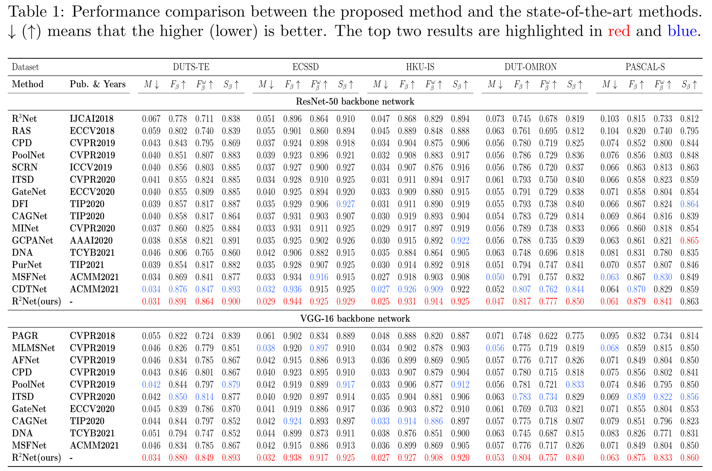
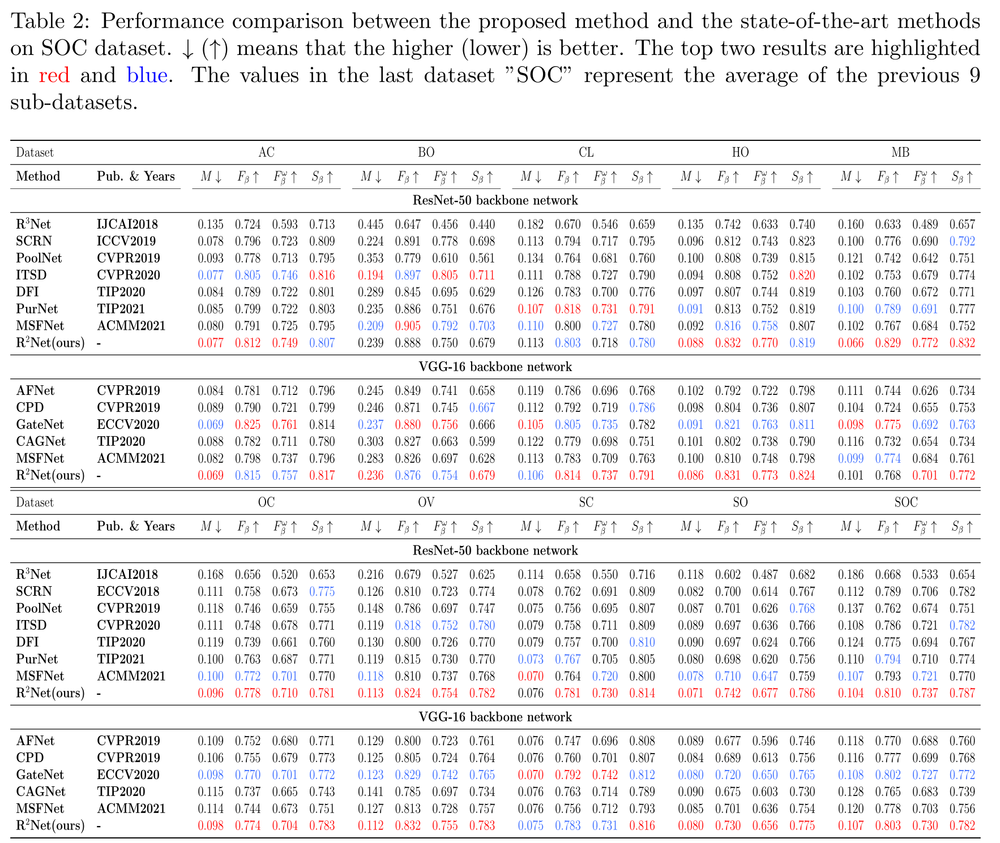
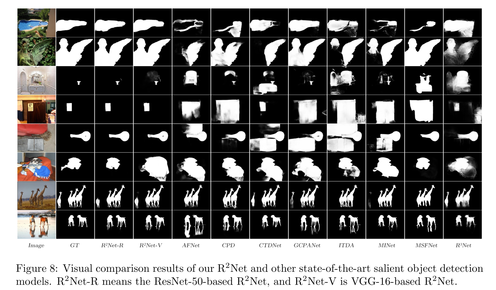

# R2Net-Residual-Refinement-Network-for-Salient-Object-Detection
This repo. is an implementation of R2Net, which is accepted for in Image and Vision Computing.

## Paper
The paper is [here](https://www.sciencedirect.com/science/article/pii/S026288562200052X?dgcid=author).

## Saliency maps
you can find the saliency maps on DUTS-TE、ECSSD、HKU-IS、DUT-OMRON and PASCAL-S datasets and the weight file from Google Driver [link](https://drive.google.com/drive/folders/1f4vewbYh368nHQR0GdskM9ZJ9fp3Pak5?usp=sharing) and the Baidu online disk [link](链接：https://pan.baidu.com/s/1cf5CgN0dStUaCgFTmMaOag?pwd=RRNe 提取码：RRNe --来自百度网盘超级会员V3的分享) (Code:RRNe)

## Codes
The train.py file contains the training code, If you want to retrain, please download the training set and test set from [here](https://aistudio.baidu.com/aistudio/datasetdetail/97810), and unzip the file, then modify the "train_dataset" parameter to your own path.

if you want to test, just modify the path of the saliency maps, and I think you have your own testing code. So I provide our saliency maps additionally.

We use the code provided by this [repo.](https://github.com/Mehrdad-Noori/Saliency-Evaluation-Toolbox) to calculate the metrics.

We choose PaddlePaddle as the framework, in particular, PaddlePaddle provides a good learning environment and hardware facilities. If you want the PyTorch version of the code, it will be available right away.

## Results
The effect of R^2Net on 5 benchmark datasets is as follows, we achieve the SOTA results than any existing SOD methods.

